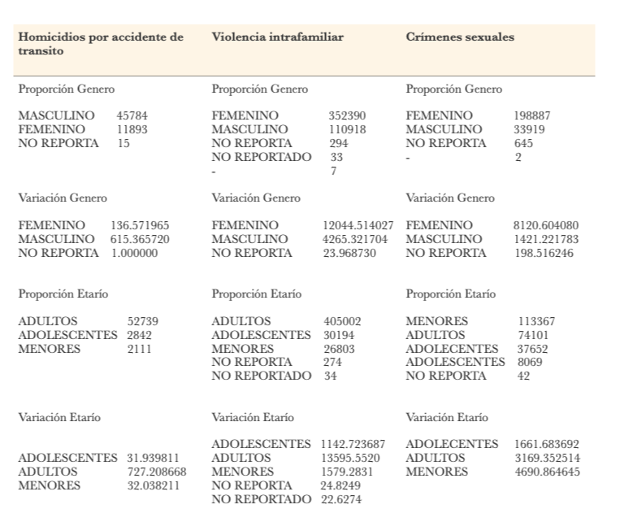
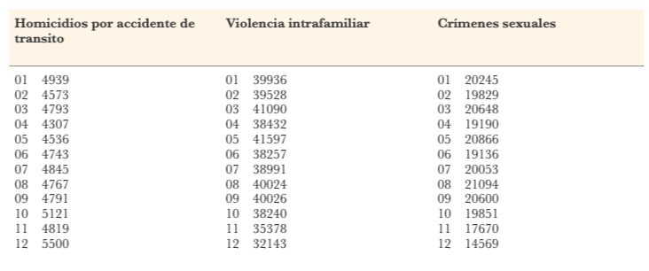

# Primer Taller:

Video: https://youtu.be/v4h_M4VZEno

### 1. ¿Cuáles han sido los departamentos (TOP 3) mas afectados a nivel histórico y en el último año?

Homicidios por accidente de transito según el departamento:

- Históricos:
1. CUNDINAMARCA    8745
2. ANTIOQUIA       7459
3. VALLE           7456
- Ultimo año:
1. ANTIOQUIA       1034
2. CUNDINAMARCA     876
3. VALLE            603

Violencia intrafamiliar según el departamento:

- Históricos:
1. CUNDINAMARCA    70193
2. ANTIOQUIA       53609
3. VALLE           44388
- Ultimo año:
1. CUNDINAMARCA    8826
2. ANTIOQUIA       7512
3. VALLE           4866

Crímenes sexuales según el departamento:
- Históricos:
1. CUNDINAMARCA    39007
2. ANTIOQUIA       26782
3. VALLE           24242

- Ultimo año:

1. CUNDINAMARCA    5204
2. ANTIOQUIA       3744
3. VALLE           2230

### 2. ¿Cuál ha sido históricamente el arma o medio más común para cometer el delito?

Homicidios por accidente de transito:
- VEHICULO: 33674

Violencia intrafamiliar:
- CONTUNDENTES: 238927

Crímenes sexuales:
-SIN EMPLEO DE ARMAS: 108905

### 3. ¿Cómo es la proporción de géneros y grupos etarios que han estado involucrados en este tipo de delito? ¿Han variado con el paso de los años?

- Para homicidios por accidente de transito, cabe recalcar que el genero Femenino tiene menos variación , y el grupo etarío con más variación es el de los adultos.
- Para violencia intrafamiliar, el genero Femenino es el que más tiene variación y proporción en los datos, el grupo etarío también es el de los adultos.
- Para crímenes sexuales, el genero Femenino es el que más tiene proporción en los datos, y el grupo etarío con más varianza es el de los niños, así como la mayor proporción.

### 4. ¿Se evidencia alguna tendencia para cometer dicho delito en algún mes particular del año?

- Para homicidios por accidente de transito, se tiene una tendencia alta en Diciembre, aunque no es una diferencia significativa.
- Para violencia intrafamiliar, se tiene una tendencia alta en Mayo, aunque no es una diferencia significativa.
- Para crímenes sexuales, se tiene una tendencia alta en Agosto, aunque no es una diferencia significativa.

### 5. Para los casos en los que se disponga del detalle del delito o de una descripción, como por ejemplo en delitos sexuales y secuestro, ¿cuáles son los delitos, descripciones o modalidades más comunes?

- Para homicidios por accidente de transito, se tiene que el homicidio culposo por accidente de transito tiene un numero significativo, 57724 casos (99.98% de los casos). 
- Para violencia intrafamiliar, no se tiene la información solicitada.
- Para crímenes sexuales, se tiene una tendencia alta en actos sexuales con menores de 14 años, 75106 casos (32.13% de los casos)

### 6. Bono

Homicidios por accidente de transito:

- Históricos:
1. BOYACA          1756	
2. CAUCA           2047	
3. ARAUCA          511
- Ultimo año:
1. PUTUMAYO	       57
2. BOYACA	       169	
3. ARAUCA	       59	

Violencia intrafamiliar:

- Históricos:
1. BOYACA	       27822	
2. SANTANDER	   39174	
3. PUTUMAYO	       3311	
- Ultimo año:
1. BOYACA	       3061
2. PUTUMAYO	       399
3. SANTANDER	   4103	

Crímenes sexuales:

- Históricos:
1. BOYACA	       27822
2. SANTANDER	   39174
3. PUTUMAYO	       3311	
- Ultimo año:
1. BOYACA	       3061	
2. PUTUMAYO	       399
3. SANTANDER	   4103
