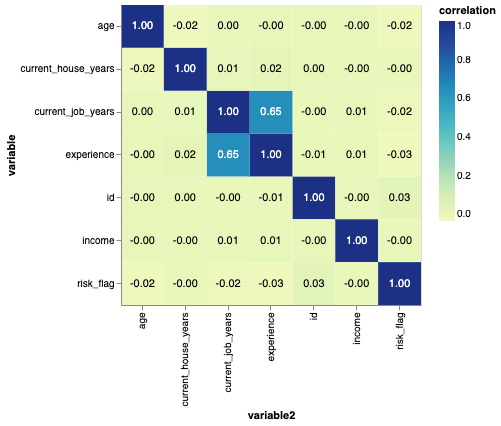
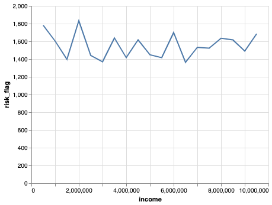
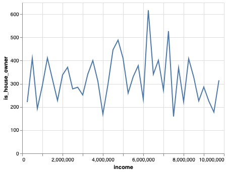
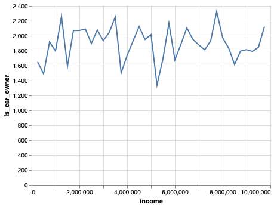
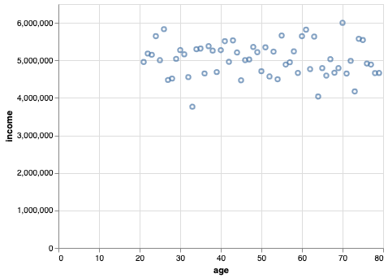
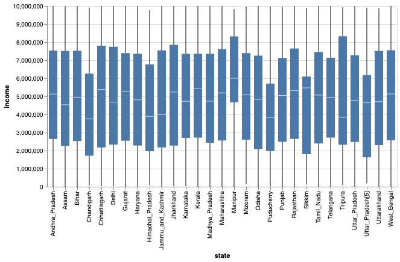

# Segundo taller Taller:

Video: https://youtu.be/wouLNmMoIfs

### 1. ¿Se podría afirmar que un mayor ingreso anual disminuye el riesgo de incumplimiento de la obligación?

La cantidad de salario influye solo en cantidades muy bajas, en los demas casos el comportamiento no tiene una tendencia descriptible, ya que en rangos de salarios medio existen cantidades similares de riesgo, y en salarios altos una mayor cantidad a cantidades medias.

### 2. ¿Se podría afirmar que la cantidad de activos está correlacionada con el ingreso anual?

No hay una correlación para ninguno de los activos presentados.

### 3. ¿Es la edad correlacionada con el ingreso anual?

No hay una correlación clara, sin embargo se puede observar que las persos más jovenes y las más adultas tienden a tener ingresos más altos

### 4. ¿Existe una brecha salarial importante dependiendo del estado en el que resida la persona?

Existen algunos estados que poseen personas con mejor rango salarial, pero el comportamiento no es tan variante.