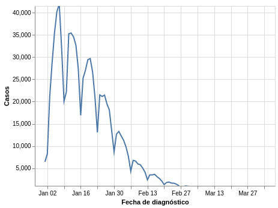
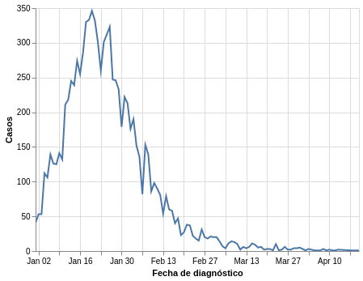

# Examen corte dos:

Los datos se pueden encontrar en el link: https://www.datos.gov.co/Salud-y-Protecci-n-Social/Casos-positivos-de-COVID-19-en-Colombia/gt2j-8ykr/data

## Preguntas
### ¿Es seguro quitar las medidas de uso de tapabocas en interiores y transporte masivo?

Casos:

Muertes:

Teniendo en cuenta la cantidad de casos positivos presentados a lo largo del tiempo, se evidencia que la curva de casos ha disminuido sustancialmente, por tanto es posible que la medida restrictiva del uso del tapabocas sea innecesaria dada la cantidad de personas vacunadas, esto sumado a que se ve que la vacuna ha sido efectiva. Asi mismo, la cantidad de personas que han muerto este año por Covid es mucho menor, presentando el ultimo mes cantidades maximas de 3 personas por día.

De cualquier forma, tener datos de las personas fallecidas podría ser de utilidad. Esto para verificar si la persona está o no vacunada.

### ¿Existe alguna tendencia entre la cantidad de casos y el sexo?

Casos por genero:

Se ve una tendencia alta al contagio mayor por parte de las mujeres con una diferencia relativa del 20%, lo que significa que de cada 10 contagios, aproximadamente 6 o 7 son mujeres

### ¿En qué departamentos se presento un numero mayor de casos?

En Cudinamarca se presenta el mayor numero de casos.